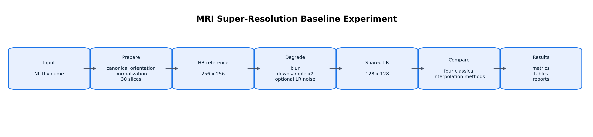
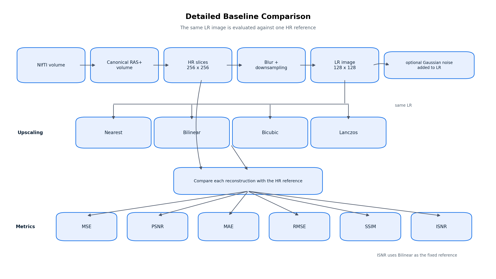

# MRI Super-Resolution Baselines

This project compares four classical interpolation methods on brain MRI slices:

- nearest neighbour
- bilinear
- bicubic
- Lanczos

## Pipeline

For every NIfTI volume:

1. Load the 3D volume.
2. Convert it to a common canonical orientation (RAS+).
3. Normalize the complete volume to `[0, 1]`, ignoring non-finite values.
4. Select exactly 30 slices for each orientation: axial, coronal, and sagittal.
5. Resize each slice to fit inside `256 x 256` while keeping its aspect ratio. Empty borders are added to fill the remaining space.
6. Apply the same synthetic degradation to every slice: Gaussian blur, scale-2 downsampling, and optional Gaussian noise added to the LR image.
7. Upscale the same LR image with all four interpolation methods.
8. Compare every reconstruction with the same HR reference.
9. Save metrics, tables, and visual reports.

The experimental order is:

```text
HR reference -> degradation -> LR -> interpolation -> comparison
```



Detailed comparison:



## Project layout

```text
src/mri_sr/
  config.py          experiment parameters
  nifti_io.py        NIfTI loading and slice extraction
  preprocessing.py   volume normalization and padded resize
  degradation.py     blur, downsampling, and noise
  interpolation.py  classical interpolation methods
  metrics.py         PSNR, MSE, MAE, RMSE, and SSIM
  experiment.py      main experiment loop
  reporting.py       CSV files and visual reports
scripts/
  run_experiment.py command-line entry point
tests/
  test_pipeline.py   unit and export tests
```

## Installation

```bash
python -m venv .venv
source .venv/bin/activate
pip install -r requirements.txt
```

Input data must be 3D `.nii` or `.nii.gz` files. Put them in `data/`, or provide another directory with `--input-dir`.

## Run

From the project root:

```bash
python scripts/run_experiment.py --input-dir data
```

To save an example report for every slice:

```bash
python scripts/run_experiment.py --input-dir data --save-all-examples
```

The main parameters are in `src/mri_sr/config.py`. Each run creates a new directory under `results/run_YYYYMMDD_HHMMSS/`, so old results are not mixed with new results.

## Metrics

The main metric is PSNR. Since images are normalized to `[0, 1]`:

```text
MSE  = mean((HR - reconstruction)^2)
PSNR = 10 * log10(1 / MSE)
```

PSNR is calculated for every slice with `data_range=1.0`. If the MSE is zero, PSNR is `inf`.

The MSE is calculated separately for every method:

```text
MSE_nearest   = MSE(HR, nearest)
MSE_bilinear  = MSE(HR, bilinear)
MSE_bicubic   = MSE(HR, bicubic)
MSE_lanczos   = MSE(HR, lanczos)
```

ISNR is not a replacement for these MSE values. It compares each method's MSE with the Bilinear MSE, which is fixed before the comparison:

```text
ISNR_method = 10 * log10(MSE_bilinear / MSE_method)
```

The Bilinear reconstruction is the fixed reference, so its ISNR is `0 dB`. A positive ISNR means that the method has a lower MSE than Bilinear. A negative ISNR means that its MSE is higher than Bilinear. The best method is still selected by the highest PSNR, not by ISNR. The other reported metrics are MAE, RMSE, SSIM, and processing time.

## Output files

Each run contains:

```text
results/run_.../
  tables/
    metrics_by_slice.csv
    metrics_by_axis.csv
    metrics_summary.csv
    runtime_summary.csv
    ranking.csv
  figures/
    examples/
  run_parameters.json
  execution_summary.txt
```

`metrics_by_slice.csv` contains the volume, orientation, slice index, method, metrics, processing time, and image dimensions. The ranking is sorted by mean PSNR; mean SSIM is used only to break a tie.

A higher PSNR means that the reconstruction is closer to the HR reference for the selected degradation settings.

## Tests

```bash
python -m pytest -q
```

The tests cover slice selection, orientation mapping, normalization, padding, image dimensions, use of the same LR input, PSNR, constant and non-finite slices, and output tables.
